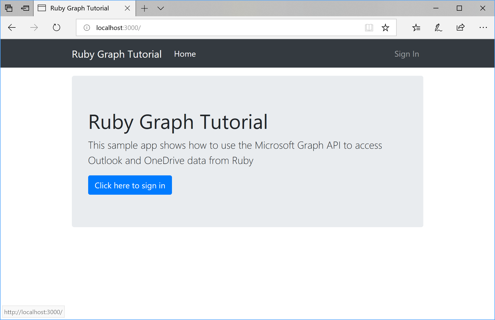

<!-- markdownlint-disable MD002 MD041 -->

En este ejercicio usará [Ruby on Rails](https://rubyonrails.org/) para crear una aplicación Web.

1. Si aún no tiene guías instaladas, puede instalarla desde la interfaz de línea de comandos (CLI) con el siguiente comando.

    ```Shell
    gem install rails -v 6.0.2.2
    ```

1. Abra la CLI, navegue hasta un directorio donde tenga derechos para crear archivos y ejecute el siguiente comando para crear una nueva aplicación de guías.

    ```Shell
    rails new graph-tutorial
    ```

1. Navegue a este nuevo directorio y escriba el siguiente comando para iniciar un servidor Web local.

    ```Shell
    rails server
    ```

1. Abra el explorador y vaya a `http://localhost:3000`. Si todo funciona, verá un error "Yay! ¡ Estás en raíles! " Mensaje. Si no ve ese mensaje, consulte la guía de introducción a los [rieles](http://guides.rubyonrails.org/).

## <a name="install-gems"></a>Instalar gemas

Antes de continuar, instale algunas gemas adicionales que usará más adelante:

- [omniauth-OAuth2](https://github.com/omniauth/omniauth-oauth2) para controlar los flujos de tokens de OAuth y inicio de sesión.
- [omniauth-rails_csrf_protection](https://github.com/cookpad/omniauth-rails_csrf_protection) para agregar la protección CSRF a omniauth.
- [httparty](https://github.com/jnunemaker/httparty) para realizar llamadas a Microsoft Graph.
- [ActiveRecord-session_store](https://github.com/rails/activerecord-session_store) para almacenar sesiones en la base de datos.

1. Abra **./Gemfile** y agregue las siguientes líneas.

    :::code language="ruby" source="../demo/graph-tutorial/Gemfile" id="GemFileSnippet":::

1. En la CLI, ejecute el siguiente comando.

    ```Shell
    bundle install
    ```

1. En la CLI, ejecute los siguientes comandos para configurar la base de datos para almacenar las sesiones.

    ```Shell
    rails generate active_record:session_migration
    rake db:migrate
    ```

1. Cree un nuevo archivo llamado `session_store.rb` en el directorio **./config/Initializers** y agregue el siguiente código.

    :::code language="ruby" source="../demo/graph-tutorial/config/initializers/session_store.rb" id="SessionStoreSnippet":::

## <a name="design-the-app"></a>Diseñar la aplicación

En esta sección, creará la interfaz de usuario básica para la aplicación.

1. Abra **./app/views/layouts/Application.html.Erb** y reemplace su contenido por lo siguiente.

    :::code language="html" source="../demo/graph-tutorial/app/views/layouts/application.html.erb" id="LayoutSnippet":::

    Este código agrega un [bootstrap](http://getbootstrap.com/) para los estilos sencillos y la [fuente maravilla](https://fontawesome.com/) para algunos iconos simples. También define un diseño global con una barra de navegación.

1. Abra **./app/assets/Stylesheets/Application.CSS** y agregue lo siguiente al final del archivo.

    :::code language="css" source="../demo/graph-tutorial/app/assets/stylesheets/application.css" id="CssSnippet":::

1. Genere un controlador de páginas principales con el siguiente comando.

    ```Shell
    rails generate controller Home index
    ```

1. Configure `index` la acción en `Home` el controlador como la página predeterminada para la aplicación. Abra **./config/Routes.RB** y reemplace su contenido por lo siguiente:

    ```ruby
    Rails.application.routes.draw do
      get 'home/index'
      root 'home#index'

      # Add future routes here

    end
    ```

1. Abra **./app/View/home/index.html.Erb** y reemplace su contenido por lo siguiente.

    :::code language="html" source="../demo/graph-tutorial/app/views/home/index.html.erb" id="HomeSnippet":::

1. Guarde todos los cambios y reinicie el servidor. Ahora, la aplicación debe tener un aspecto muy diferente.

    
