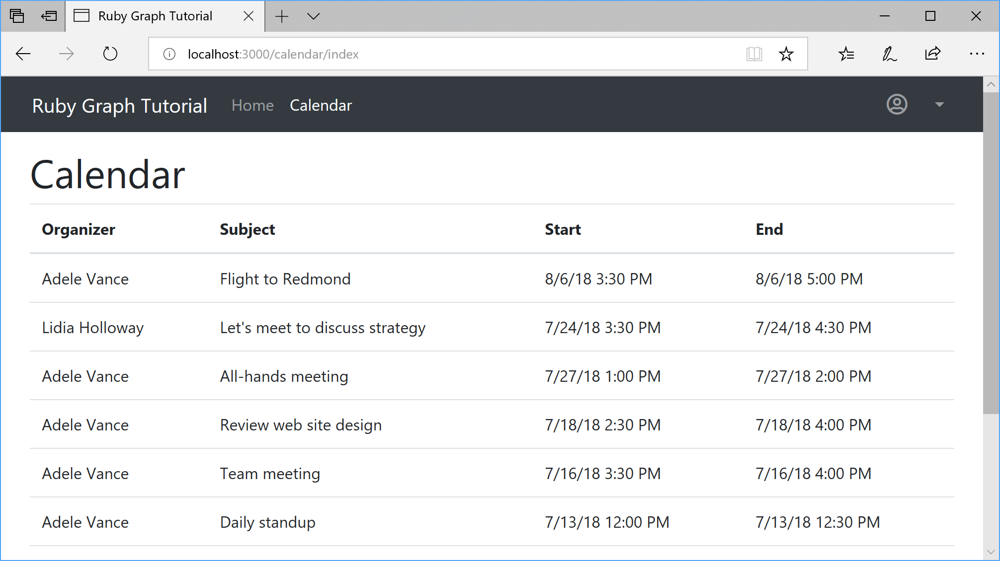

<!-- markdownlint-disable MD002 MD041 -->

En este ejercicio, incorporará Microsoft Graph a la aplicación. Para esta aplicación, usará la GEM [httparty](https://github.com/jnunemaker/httparty) para realizar llamadas a Microsoft Graph.

## <a name="create-a-graph-helper"></a>Crear una aplicación auxiliar de gráfico

1. Cree una aplicación auxiliar para administrar todas las llamadas a la API. Ejecute el siguiente comando en su CLI para generar la aplicación auxiliar.

    ```Shell
    rails generate helper Graph
    ```

1. Abra **./app/helpers/graph_helper. RB** y reemplace el contenido por lo siguiente.

    ```ruby
    require 'httparty'

    # Graph API helper methods
    module GraphHelper
      GRAPH_HOST = 'https://graph.microsoft.com'.freeze

      def make_api_call(endpoint, token, params = nil)
        headers = {
          Authorization: "Bearer #{token}"
        }

        query = params || {}

        HTTParty.get "#{GRAPH_HOST}#{endpoint}",
                     headers: headers,
                     query: query
      end
    end
    ```

Tómese un momento para revisar lo que hace el código. Realiza una sencilla solicitud GET a través del `httparty` GEM al punto de conexión solicitado. Envía el token de acceso en el `Authorization` encabezado e incluye los parámetros de consulta que se pasan.

Por ejemplo, para usar el `make_api_call` método para realizar una llamada a `https://graph.microsoft.com/v1.0/me?$select=displayName`get, puede llamarlo de esta manera:

```ruby
make_api_call `/v1.0/me`, access_token, { '$select': 'displayName' }
```

A partir de entonces, podrá crear más adelante a medida que implementa más características de Microsoft Graph en la aplicación.

## <a name="get-calendar-events-from-outlook"></a>Obtener eventos de calendario de Outlook

1. En la CLI, ejecute el siguiente comando para agregar un nuevo controlador.

    ```Shell
    rails generate controller Calendar index
    ```

1. Agregue la nueva ruta a **./config/Routes.RB**.

    ```ruby
    get 'calendar', to: 'calendar#index'
    ```

1. Agregue un nuevo método a la aplicación auxiliar de Graph para [Mostrar los eventos del usuario](/graph/api/user-list-events?view=graph-rest-1.0). Abra **./app/helpers/graph_helper. RB** y agregue el siguiente método al `GraphHelper` módulo.

    :::code language="ruby" source="../demo/graph-tutorial/app/helpers/graph_helper.rb" id="GetCalendarSnippet":::

    Tenga en cuenta lo que está haciendo este código.

    - La dirección URL a la que se `/v1.0/me/events`llamará es.
    - El `$select` parámetro limita los campos devueltos para cada evento a solo aquellos que la vista usará realmente.
    - El `$orderby` parámetro ordena los resultados por la fecha y hora en que se crearon, con el elemento más reciente en primer lugar.
    - Para una respuesta correcta, devuelve la matriz de elementos contenidos en la `value` clave.

1. Abra **./app/controllers/calendar_controller. RB** y reemplace todo el contenido por lo siguiente.

    ```ruby
    # Calendar controller
    class CalendarController < ApplicationController
      include GraphHelper

      def index
        @events = get_calendar_events access_token || []
        render json: @events
      rescue RuntimeError => e
        @errors = [
          {
            message: 'Microsoft Graph returned an error getting events.',
            debug: e
          }
        ]
      end
    end
    ```

1. Reinicie el servidor. Inicie sesión y haga clic en el vínculo de **calendario** en la barra de navegación. Si todo funciona, debería ver un volcado JSON de eventos en el calendario del usuario.

## <a name="display-the-results"></a>Mostrar los resultados

Ahora puede Agregar HTML para mostrar los resultados de forma más fácil de uso.

1. Abra **./app/views/Calendar/index.html.Erb** y reemplace su contenido por lo siguiente.

    :::code language="html" source="../demo/graph-tutorial/app/views/calendar/index.html.erb" id="CalendarSnippet":::

    Se recorrerá en bucle una colección de eventos y se agregará una fila de tabla para cada uno.

1. Quite la `render json: @events` línea de la `index` acción en **./app/Controllers/calendar_controller. RB**.

1. Actualice la página y la aplicación ahora debería representar una tabla de eventos.

    
